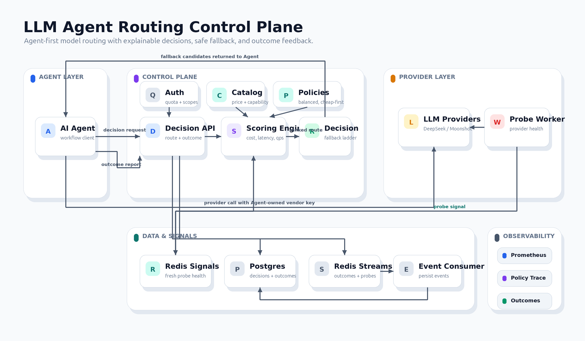
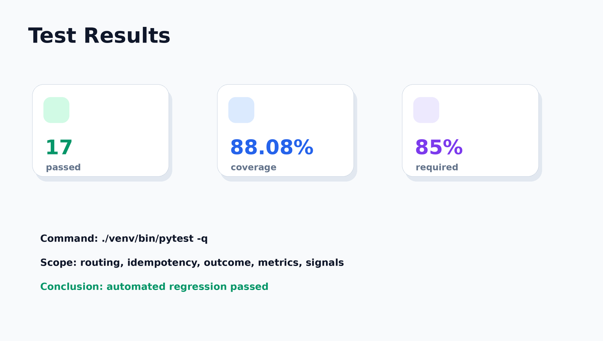

# LLM Agent Routing Control Plane：面向 AI Agent 的模型路由控制面

> 在真实调用大模型前，根据预算、延迟、模型能力、健康信号和策略权重，为 Agent 返回可解释的模型选择与 fallback 梯队。

## 项目概览

| 项目维度 | 内容 |
| --- | --- |
| 项目类型 | AI 基础设施产品 / Developer Tool |
| 目标用户 | 构建 AI Agent、workflow、企业内部 AI 工具的开发者或团队 |
| 我的角色 | 产品定义、系统设计、API 设计、后端实现、测试验收、Demo 打磨 |
| 交付形态 | FastAPI 控制面、模型目录、路由策略、Redis signal、Postgres 持久化、worker、Prometheus metrics、Example Agent |
| 当前验证 | `17 passed`、`88.08% coverage`、Docker 三进程联动通过、Example Agent E2E 通过 |

## 产品问题

当一个 AI Agent 需要调用大模型时，团队通常会直接在代码里写死一个模型。但在真实业务里，模型选择不是单点决策：

- 不同模型的价格、延迟、上下文窗口、能力边界不同。
- Provider 可能限流、超时或出现 5xx。
- Agent 需要在成本、稳定性、质量和响应速度之间动态取舍。
- 如果没有 outcome 回写，团队无法判断某次推荐是否真的成功、省钱、低延迟。

产品机会是把“选哪个模型、失败怎么降级、结果怎么回流”抽象成一个独立的路由控制面，让 Agent 在调用前先获得一份可解释、可追踪、可重试的 decision。

## 核心用户旅程

1. Agent 提交任务特征：任务类型、预算、上下文长度、延迟 SLO、能力要求。
2. 控制面返回 routing decision：推荐模型、候选梯队、过滤原因、观测字段。
3. Agent 使用自己的 vendor key 直接调用模型厂商。
4. 如果首选失败，Agent 按候选梯队 fallback。
5. 调用完成后，Agent 回写 outcome，用于审计、预算统计和后续策略调优。

## 方案架构



这张图展示了 Agent-first 决策、fallback、outcome 回写和观测闭环。

Mermaid 源文件：[architecture.mmd](./architecture.mmd)

这个系统更像“导航系统”，不是“代驾系统”。控制面告诉 Agent 这次应该优先选择哪条路线、有哪些备选路线、为什么某些路线不可用；但真实模型调用仍由 Agent 自己完成，控制面不集中持有用户的厂商密钥。

## 产品能力 Demo

完整 Demo 素材见：[api-demo.md](./api-demo.md)

### Demo 1：创建路由决策

接口：`POST /v1/routing/decisions`

输入包括：

- `task_type`
- `budget_limit_usd`
- `latency_slo_ms`
- `context_window_tokens`
- `capability_requirements`
- `policy_id`

输出重点：

- `decision_id`：可追踪决策。
- `recommended`：首选模型。
- `candidates`：fallback 梯队。
- `rejections`：被过滤模型及原因。
- `observability`：候选数、过滤数、决策耗时、policy trace。

### Demo 2：结果回写与幂等

接口：`POST /v1/routing/outcomes`

第一次回写返回：

```json
{
  "outcome_status": "recorded",
  "final_status": "success"
}
```

重复回写返回：

```json
{
  "outcome_status": "duplicate",
  "final_status": "success"
}
```

### Demo 3：Example Agent E2E

Example Agent 完整走通：

- 请求 routing decision。
- 获取候选梯队。
- 使用自己的 provider key 调用模型。
- 选中 `deepseek/deepseek-chat`。
- 回写最终 outcome。

## 测试与可信度



| 验证类型 | 结果 |
| --- | --- |
| 自动化测试 | `17 passed` |
| 覆盖率 | `88.08%`，超过 `85%` 门槛 |
| 控制面接口 | health、catalog、policies、decision、outcome 通过 |
| 持久化 | Postgres decision/outcome 落库通过 |
| 事件流 | Redis Streams outcome/probe 事件通过 |
| Worker 联动 | decision-api / probe-worker / event-consumer 三进程联动通过 |
| Example Agent | E2E 调用通过，选中 `deepseek/deepseek-chat` |

这不是静态概念页，而是有 API、持久化、worker 和观测闭环的可运行系统。

## 产品判断

| 判断 | 说明 |
| --- | --- |
| 为什么不做代理网关 | 控制面不持有用户 vendor key，降低密钥集中暴露风险，也让 Agent 保持对 SDK、重试和工具调用的控制。 |
| 为什么需要 durable decision | 一次决策可追踪、可重试、可审计，适合真实 Agent workflow。 |
| 为什么需要 outcome 回写 | 没有结果回写，就无法知道推荐模型是否真的成功、省钱、低延迟。 |
| 为什么先做 API 而不是 dashboard | MVP 面向开发者集成，API 是最短交付路径；dashboard 可以作为下一阶段增强。 |
| 为什么用策略而不是裸权重 | 产品上更容易理解和运营，例如 `balanced`、`cheap-first`、`latency-first`。 |

## 产品复盘

### MVP 做对的事

- 先解决 Agent 调用前最关键的 decision，而不是一开始做复杂后台。
- 将 fallback、过滤原因和 observability 放进 API 契约，让使用方可以调试和复盘。
- 选择 Agent-first 设计，控制面只做决策，不接管厂商调用。
- 用测试和手工验收覆盖核心链路，保证展示内容可验证。

### 当前边界

- 还没有完整 dashboard。
- 准确率维度仍主要来自静态配置和 outcome 回写，尚未自动调权。
- 缺少 shadow mode 和 route replay。
- 租户管理后台和策略配置 UI 仍在路线图中。

### 下一步路线图

| 阶段 | 目标 |
| --- | --- |
| v1.1 | 模型 registry 热更新、策略配置治理、route outcome 聚合 |
| v1.2 | shadow mode、route replay、策略对比实验 |
| v1.3 | 成本报表、团队/租户视图、管理 dashboard |

## 面试讲述版本

我把这个项目定位成一个 AI Agent 基础设施产品，而不是普通后端 demo。核心问题是：当 Agent 有多个模型可选时，硬编码模型会带来成本、延迟和稳定性风险。所以我设计了一个控制面，让 Agent 在真实调用前提交任务约束，控制面返回可解释的模型推荐和 fallback 梯队。调用完成后，Agent 再把 outcome 回写，这样系统就能形成可观测闭环。

我在产品上刻意没有做成代理网关，因为那会让控制面集中持有用户 vendor key，也会限制 Agent 自己处理 SDK、工具调用和重试。我选择先做 API 型 MVP，是因为目标用户是开发者和 Agent 团队，API 是最短集成路径。后续可以在这个控制面之上增加 dashboard、策略回放和成本报表。
